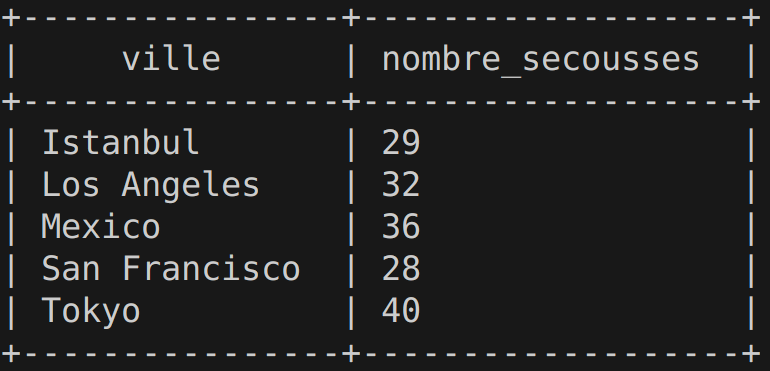
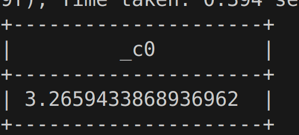
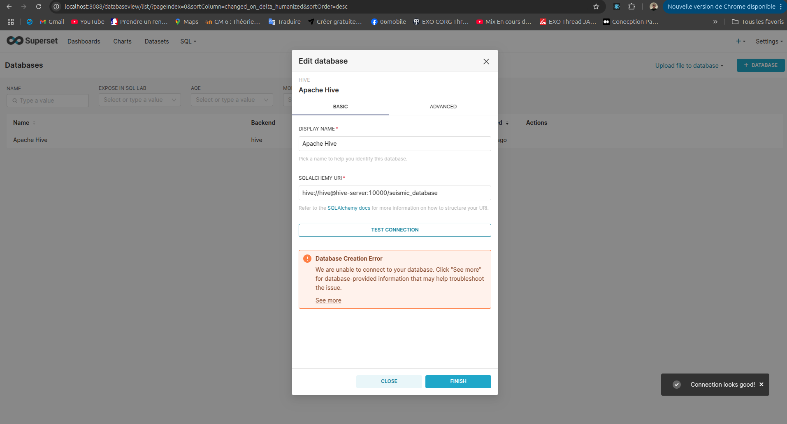
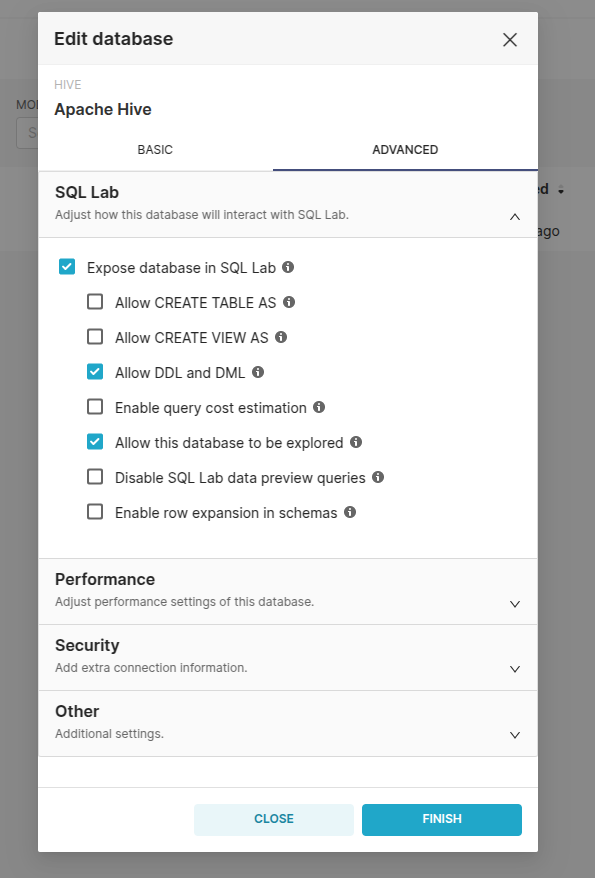
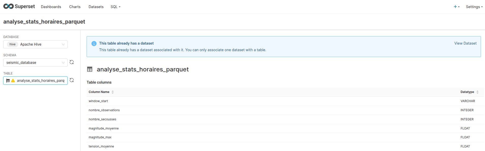
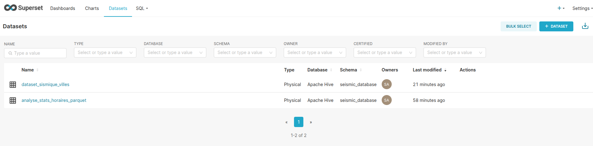
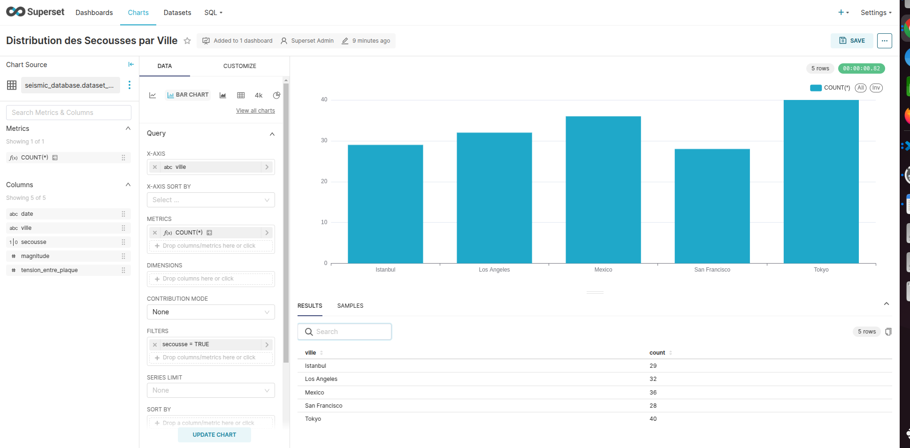
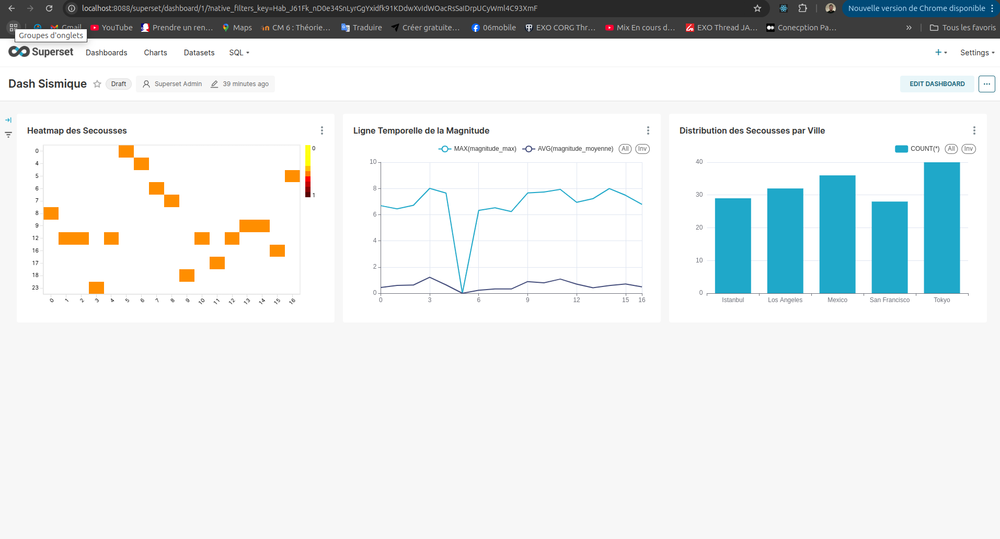

# TP
# repo Github : https://github.com/Abderahim-CHEMMOU/Seismic_Data_Pipeline_Analytics_Platform
# Partie 1 : Exploration et Traitement des Données Sismiques
# Exo1

déploiement de l'infra bigData avec docker-compose

# Exo2

### HDFS
```bash
# entrez dans le namenode pour utiliser le hdfs
docker exec -it namenode bash
# Vérifier la présence des données
ls /data
# vous aurez ces données qu'il faut charger dans le hfds
# dataset_sismique.csv  dataset_sismique_villes.csv

# Créer des répertoires HDFS pour les données sismiques
hdfs dfs -mkdir -p /user/hive/warehouse/seismic_data/dataset_sismique
hdfs dfs -mkdir -p /user/hive/warehouse/seismic_data/dataset_sismique_villes

# Copier les fichiers CSV de /data vers HDFS
hdfs dfs -put /data/dataset_sismique.csv /user/hive/warehouse/seismic_data/dataset_sismique/dataset_sismique.csv
hdfs dfs -put /data/dataset_sismique_villes.csv /user/hive/warehouse/seismic_data/dataset_sismique_villes/dataset_sismique_villes.csv

# Vérifier que les fichiers sont bien dans HDFS
hdfs dfs -ls /user/hive/warehouse/seismic_data/dataset_sismique
hdfs dfs -ls /user/hive/warehouse/seismic_data/dataset_sismique_villes
```

### Hive
```bash
# accéder à conteneur Hive
docker exec -it hive-server bash
# se connecter à Hive
beeline -u jdbc:hive2://hive-server:10000
```

```sql
# créer une base de données
CREATE DATABASE IF NOT EXISTS seismic_database;
# Vérifier si la base de données est bien crée
SHOW DATABASES;
# accéder à la base pour créer des données
use seismic_database;
# créer les tables
CREATE EXTERNAL TABLE IF NOT EXISTS dataset_sismique (
    `date` STRING,
    secousse BOOLEAN,
    magnitude DOUBLE,
    tension_entre_plaque DOUBLE
)
ROW FORMAT DELIMITED FIELDS TERMINATED BY ','
STORED AS TEXTFILE
LOCATION 'hdfs://namenode:9000/user/hive/warehouse/seismic_data/dataset_sismique'
TBLPROPERTIES ("skip.header.line.count"="1"); -- Ajout de la propriété skip.header.line.count

CREATE EXTERNAL TABLE IF NOT EXISTS dataset_sismique_villes (
    `date` STRING,
    ville STRING,
    secousse BOOLEAN,
    magnitude DOUBLE,
    tension_entre_plaque DOUBLE
)
ROW FORMAT DELIMITED FIELDS TERMINATED BY ','
STORED AS TEXTFILE
LOCATION 'hdfs://namenode:9000/user/hive/warehouse/seismic_data/dataset_sismique_villes'
TBLPROPERTIES ("skip.header.line.count"="1"); -- Ajout de la propriété skip.header.line.count

#vérifier que les données sont bien chargés dans Hive
SELECT * FROM dataset_sismique LIMIT 3;
SELECT * FROM dataset_sismique_villes LIMIT 3;

# Afficher le schema des tables
DESCRIBE dataset_sismique;
DESCRIBE dataset_sismique_villes;

# Compter le nombre de lignes dans chaque table
SELECT COUNT(*) FROM dataset_sismique;
# 1001 données
SELECT COUNT(*) FROM dataset_sismique_villes;
# 1001

# Trouver le nombre de secousses par ville (dans dataset_sismique_villes)
SELECT ville, SUM(CASE WHEN secousse THEN 1 ELSE 0 END) AS nombre_secousses
FROM dataset_sismique_villes
GROUP BY ville;



-- Calculer la magnitude moyenne (dans dataset_sismique) :
SELECT AVG(magnitude) FROM dataset_sismique WHERE magnitude > 0; -- Exclut les magnitudes de 0.0


```

# Exo3

```bash
# accéder à spark-master
docker exec -it spark-master bash
# exécuter le script qui netoi la données et la stock dans le HDFS
spark-submit /app/nettoyage_sismique.py
```

# Exo4 

# Analyse des Événements Sismiques
## fichier "/app/analyse_preliminaire.py"
Analyse Préliminaire des Données Sismiques avec PySpark
Ce script PySpark effectue une analyse préliminaire des données sismiques en calculant des statistiques horaires clés. Il s'intègre dans notre pipeline de traitement des données sismiques.
Fonctionnalités

Agrégation des données par fenêtre horaire
Calcul des métriques suivantes :

Nombre total d'observations par heure
Nombre de secousses détectées
Magnitude moyenne des événements
Magnitude maximale enregistrée
Tension moyenne entre les plaques

Résultats notables
L'analyse montre des variations significatives dans l'activité sismique :

Pics d'activité : Jusqu'à 12 secousses par heure avec des magnitudes maximales dépassant 7.0
Périodes calmes : Certaines heures sans aucune secousse (ex: 05:00:00)
Tension variable : La tension entre les plaques oscille entre 1.07 et 1.43

Stockage
Les résultats sont sauvegardés au format Parquet dans HDFS pour une utilisation ultérieure dans l'analyse et la visualisation avec Apache Superset.

# Exo5

## Fichier du code : /app/analyse_correlation.py
# Analyse des Corrélations Sismiques - Résultats

## Vue d'ensemble
Cette analyse examine les corrélations entre différents événements sismiques et identifie les motifs précurseurs potentiels dans deux datasets : un dataset général et un dataset par villes.

## Résultats Clés

### 1. Analyse Globale

#### Dataset Général
- Seuil d'événement majeur : > 1.04 magnitude
- Nombre d'événements majeurs : 100
- Précurseurs moyens :
  - 13.54 secousses avant l'événement
  - Magnitude moyenne précédente : 0.74
  - Tension moyenne : 1.09

#### Dataset par Villes
- Seuil d'événement majeur : > 0.87 magnitude
- Nombre d'événements majeurs : 100
- Précurseurs moyens :
  - 46.34 secousses avant l'événement
  - Magnitude moyenne précédente : 0.55
  - Tension moyenne : 1.10

### 2. Corrélations Significatives

#### Dataset Général
- Fortes corrélations positives :
  - Magnitude moyenne précédente - Nombre de secousses précédentes (0.955)
- Corrélations négatives notables :
  - Tension - Magnitude (-0.348)
  - Nombre de secousses - Tension moyenne (-0.574)

### 3. Analyse par Ville

#### Los Angeles
- 32 secousses enregistrées
- Magnitude max : 8.03
- Corrélation magnitude-tension : -0.377
- Pic d'activité : 2h (7 événements)

#### Tokyo
- 40 secousses enregistrées
- Magnitude max : 7.54
- Forte corrélation secousses-magnitude (0.912)
- Pic d'activité : 1h (10 événements)

#### Mexico
- 36 secousses enregistrées
- Magnitude max : 7.90
- Corrélation magnitude-tension : -0.406
- Forte corrélation précurseurs-magnitude (0.925)

#### San Francisco
- 28 secousses enregistrées
- Magnitude max : 7.84
- Pic d'activité : 1h (9 événements)

#### Istanbul
- 29 secousses enregistrées
- Magnitude max : 7.06
- Corrélation magnitude-tension : -0.436

## Patterns Temporels Clés

### Distribution horaire des événements majeurs
1. Heures les plus actives :
   - 1h-2h : Plus forte activité globale
   - 3h-4h : Pics secondaires
2. Heures les plus calmes :
   - 5h-8h : Activité minimale
   - 16h-23h : Activité réduite

## Conclusions Principales

1. **Précurseurs** :
   - Une augmentation du nombre de petites secousses précède généralement les événements majeurs
   - La tension entre plaques diminue légèrement avant les grandes secousses

2. **Patterns Géographiques** :
   - Los Angeles : événements les plus intenses
   - Tokyo : fréquence la plus élevée
   - Mexico : forte corrélation précurseurs-magnitude

3. **Temporalité** :
   - Activité maximale entre 0h et 4h
   - Pattern similaire dans toutes les villes

4. **Corrélations Universelles** :
   - Corrélation négative constante entre magnitude et tension
   - Forte corrélation entre nombre de précurseurs et magnitude des événements

## Implications pour la Prédiction

1. L'augmentation du nombre de petites secousses est un indicateur fiable
2. La baisse de tension entre plaques peut servir d'alerte précoce
3. Les périodes 0h-4h nécessitent une surveillance accrue
4. Chaque ville présente des patterns spécifiques à prendre en compte

# Exo6
## Fichier : /app/analyse_agregation
# Agrégation des Données Sismiques - Résultats d'Analyse

## Vue d'ensemble
Cette analyse présente l'agrégation des données sismiques sur différents intervalles temporels pour identifier les patterns et tendances d'activité sismique.

## 1. Analyse du Dataset Général

### Statistiques Horaires
- **Pics d'activité** :
  - Heure la plus active : 3h (23 secousses, magnitude max 8.01)
  - Magnitude moyenne la plus élevée : 1.22 (3h)
  - Période calme : 5h (0 secousse)

### Tendances de Tension
- Tension maximale : 1.44 (5h)
- Tension minimale : 1.04 (9h)
- Corrélation négative entre tension et activité sismique

### Périodes Critiques (fenêtres de 30 minutes)
1. 3h00-3h30 : 10 événements (max 8.01)
2. 11h30-12h00 : 7 événements (max 7.93)
3. 9h30-10h00 : 7 événements (max 6.16)

## 2. Analyse du Dataset par Villes

### Statistiques Globales par Heure
- **1h00-2h00** : Période la plus active
  - 59 secousses
  - Magnitude moyenne : 0.68
  - Magnitude max : 8.03

### Analyse par Ville

#### Tokyo
- **Période critique** : 1h00-2h00
  - 12 événements majeurs
  - Magnitude max : 7.54
- Activité concentrée le matin (0h-1h)

#### Mexico
- **Pic d'activité** : 0h00-1h00
  - 8 événements majeurs
  - Magnitude max : 7.68
- Distribution régulière sur les premières heures

#### Los Angeles
- **Événements les plus intenses**
  - Magnitude max : 8.03 (1h00-2h00)
  - Distribution équilibrée des secousses

#### Patterns Communs
1. **Heures Actives** :
   - 0h00-2h00 : Activité maximale
   - 1h00-2h00 : Pic général d'intensité

2. **Tendances de Tension** :
   - Plus élevée pendant les périodes calmes
   - Baisse pendant les périodes de forte activité

## 3. Fenêtres d'Analyse 15 Minutes

### Dataset Général
- **Pics d'Intensité** :
  - 00h15-00h30 : Magnitude moyenne 0.74
  - Variations rapides de l'activité

### Dataset par Villes
- **Période Critique** : 00h45-1h00
  - 18 secousses
  - Magnitude max : 7.84
  - Tension moyenne : 1.15

## Conclusions Principales

1. **Patterns Temporels**
   - Activité maximale : 0h00-4h00
   - Période calme : 5h00-8h00
   - Cycles d'activité de ~3 heures

2. **Spécificités Géographiques**
   - Tokyo : Plus grande fréquence d'événements
   - Los Angeles : Magnitudes les plus élevées
   - Istanbul : Distribution plus uniforme

3. **Indicateurs de Risque**
   - Baisse de tension précédant les pics d'activité
   - Accumulation d'événements mineurs sur 15-30 minutes
   - Patterns spécifiques par ville

## Implications pour la Surveillance
1. Surveillance accrue pendant les premières heures (0h-4h)
2. Attention particulière aux variations de tension
3. Monitoring spécifique par ville aux heures critiques identifiées
4. Systèmes d'alerte basés sur les fenêtres de 15 minutes

# Exo7

- Ajout de conteneur kafka sur docker compose avec un producer 

# Exo8

## Fichier /app/analyse_temporelle.py

## Compilation 

```bash
spark-submit --packages org.apache.spark:spark-sql-kafka-0-10_2.12:3.3.0 /app/analyse_temporelle.py
```

# Analyse Prédictive des Séismes en Temps Réel

## Description
Ce projet implémente un système d'analyse en temps réel des données sismiques utilisant Apache Spark Streaming et Kafka pour détecter les patterns précurseurs de séismes.

## Architecture

### Composants
1. **Kafka Producer**
   - Lit les données sismiques depuis un fichier CSV
   - Envoie les données en continu (1 message/seconde)
   - Format des messages :
     ```json
     {
         "timestamp": "2024-01-01 13:44:00",
         "secousse": false,
         "magnitude": 0.0,
         "tension_entre_plaque": 1.04
     }
     ```

2. **Spark Streaming Application**
   - Analyse en temps réel avec fenêtres glissantes de 5 minutes
   - Calcule les statistiques et indicateurs de risque
   - Génère des alertes basées sur des critères prédéfinis

## Algorithme de Détection

### Fenêtres d'Analyse
- Durée : 5 minutes
- Glissement : 1 minute
- Watermark : 10 minutes (gestion des données tardives)

### Niveaux de Risque

1. **ÉLEVÉ** :
   - Variation de tension > 0.02
   - Tension moyenne > 1.05
   - Génère une alerte d'urgence

2. **MODÉRÉ** :
   - Tension maximale > 1.08 OU
   - Présence de secousses dans la fenêtre
   - Génère une alerte de surveillance

3. **FAIBLE** :
   - Tension moyenne > 1.06
   - Variation faible (< 0.01)
   - Information de suivi

## Résultats d'Analyse

### Exemples de Détection

1. **Alerte Majeure** (01:30:00 - 01:35:00)
   ```
   Tension moyenne: 1.06
   Variation: 0.04
   Secousses: 2
   Magnitude max: 6.16
   ```

2. **Période à Risque** (15:31:00 - 15:36:00)
   ```
   Tension moyenne: 1.066
   Variation: 0.10
   Secousses: 2
   Magnitude max: 0.18
   ```

### Patterns Identifiés
1. **Précurseurs de Séismes**
   - Augmentation rapide de la tension (>0.04)
   - Séquence de petites secousses
   - Tension moyenne élevée (>1.08)

2. **Faux Positifs**
   - Variations de tension sans secousses
   - Ex: 00:32:00 - 00:37:00 (Tension: 1.18, 0 secousse)

## Performance du Système
- Traitement en temps réel efficace
- Détection précoce des conditions à risque
- Faible latence (<1 minute)

## Limitations et Améliorations Possibles
1. Ajustement des seuils selon le contexte géographique
2. Intégration de données historiques pour l'apprentissage
3. Prise en compte de facteurs environnementaux supplémentaires

## Utilisation

### Démarrage
```bash
# Lancer Kafka et Zookeeper
docker-compose up -d kafka zookeeper

# Démarrer le producer
python producer.py

# Lancer l'analyse Spark
spark-submit --packages org.apache.spark:spark-sql-kafka-0-10_2.12:3.3.0 analyse_temporelle.py
```

### Surveillance
Les alertes sont affichées en temps réel dans la console avec :
- Horodatage
- Niveau de risque
- Mesures détaillées
- Recommandations

# Bonus

### En premier il faut créer une base de données dans hive et crée les tables qui vont pointer vers le HDFS

```sql
-- Créer la base de données
CREATE DATABASE IF NOT EXISTS seismic_database;

-- Utiliser la base de données
USE seismic_database;

CREATE EXTERNAL TABLE IF NOT EXISTS analyse_stats_horaires_parquet (
    window_start STRING,
    nombre_observations INT,
    nombre_secousses INT,
    magnitude_moyenne DOUBLE,
    magnitude_max DOUBLE,
    tension_moyenne DOUBLE
)
STORED AS PARQUET
LOCATION 'hdfs://namenode:9000/user/hive/warehouse/seismic_data/analyse_stats_horaires';
```

- Ensuite il faut mettre en place superset avec redis sur docker-compose

- Une fois démarré, vous pourrez accéder à Superset via :

   URL : http://localhost:8088
   Username : admin
   Password : admin

- Créer une connexion vers Hive en suivant la conf suivante





- Créer des datasets 





- Créer des charts




- Créer un Dashbord et rajouter les charts crée

